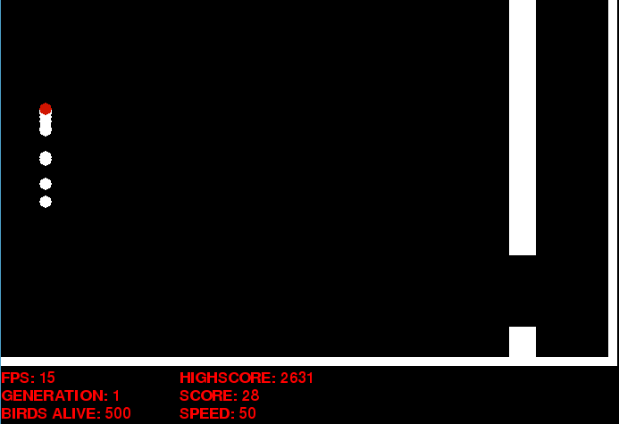

# YAFBGA
### Yet Another Flappy Bird Genetic Algorithm
 
Welcome to Yet Another Flappy Bird Genetic Algorithm this was done with Pygame and mainly Numpy for all the NN architecture. It is a simple approach yet a working one (Mostly). 

Once you run main.py you will see the window popup and it will automatically start running the game, it will generate 500 “birds” (At this point the FPS drop, sorry for my lack of optimizing abilities but I’m quite new to Pygame) each of them with different weights and biases. 

Each time all birds die it will take the best bird of that generation and mutate it to generate 500 new birds with slightly different weights and biases, also it will keep that bird so you can see its performance on the new generation (The red bird) 

      

At the bottom you can see some useful info like the FPS, Generation #, how many birds are still alive, overall high score, score of current gen, and speed (It isn't actually speed it just locks the FPS).

You can control the "speed" with the left and right arrows (If you set speed to a negative number it will run at the highest FPS possible), also you can press the spacebar so that only the best bird of the current generation is displayed.

------------
At each generation it will be saved a .csv file with all of the scores. You can use graph.py to see a plot that shows the quartiles at each generation (Not very useful since there will be a moment that the best bird will have a score of millions and all the other birds might have really low scores, so the plot is just one line going really high and the other 3 look almost flat, but I thought it will be cool to graph it).

The score is calculated this way:
- +1  for every frame the bird is alive.
- +10 for every frame that the bird is between the pipes gap.

------------
To do list:
1.  Add feature tu save current state and load from saved file.
